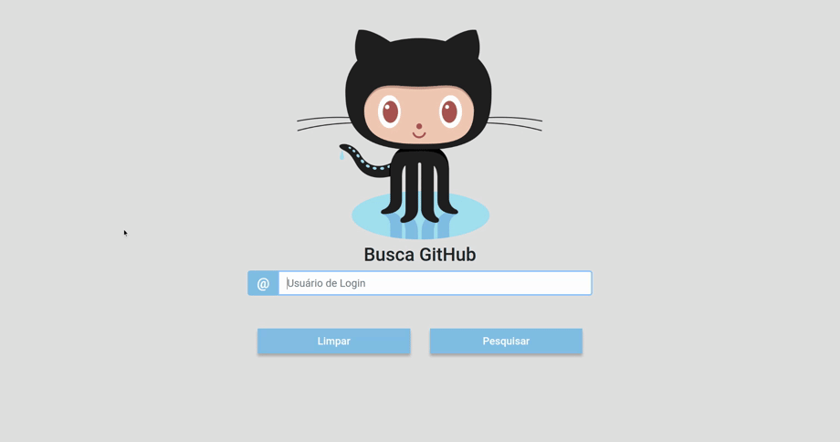

<div align="center">
  <h1>Busca GitHub</h1>

  
  <h5 style="margin: 0">
    <a href="https://5e951a134bae0d62de59228e--busca-github.netlify.app/">Acessar demonstração do projeto</a>
  </h5>
  


  [](https://travis-ci.com/adrianofelisberto/busca-github)
  [](https://sonarcloud.io/dashboard?id=adrianofelisberto_busca-github)
  [](https://www.gnu.org/licenses/gpl-3.0)
</div>

___

## :memo: Sobre
O projeto é uma **busca de usuário** do GitHub, utilizando o login de acesso.
<br>É exibida informações básicas. Tendo a possibilidade de visualizar os repositórios, ordenados pela quantidade de estrelas, em ordem decrescente.

___
## :rocket: Tecnologias utilizadas
- [Angular 9](https://angular.io/)
- [Bootstrap](https://getbootstrap.com/)
- [Jasmine](https://jasmine.github.io/)
- [Sonar](https://sonarcloud.io/)
- [Travis-ci](https://travis-ci.com/)

___
### :clipboard: Pré-requisito
- Instalar o [NodeJs](https://nodejs.org/en/)

___
### :package: Como baixar o projeto
``` bash
  # Clonar o repositório
  $ git clone https://github.com/adrianofelisberto/busca-github.git

  # Entrar no diretório
  $ cd busca-github

  # Instalar as dependências
  $ npm install

  # Iniciar o projeto
  $ npm start
  
```
___

## :white_check_mark: Para rodar os testes
``` bash
  $ npm run test
```

##  License

Este projeto é licenciado pela GPL v3 - veja o arquivo [LICENSE](https://github.com/adrianofelisberto/busca-github/blob/master/LICENSE) para detalhes
